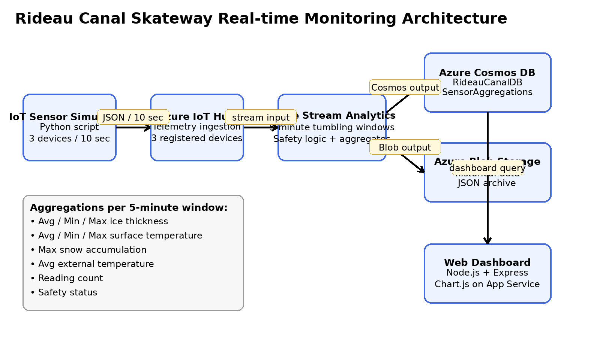

# Rideau Canal Skateway Real-time Monitoring System

## Project Description
This project was developed for **CST8916 - Remote Data and Real-time Applications**. It implements a cloud-based real-time monitoring system for the **Rideau Canal Skateway** in Ottawa. The system simulates IoT sensors at **Dow's Lake**, **Fifth Avenue**, and **NAC**, processes the telemetry in **Azure Stream Analytics**, stores recent aggregated data in **Azure Cosmos DB**, archives historical data in **Azure Blob Storage**, and visualizes the results through a web dashboard hosted on **Azure App Service**.

## Student Information
- **Name:** Your Full Name
- **Student ID:** Your Student ID
- **Course:** CST8916 - Remote Data and Real-time Applications

## Repository Links
- **Main Documentation Repository:** `https://github.com/yourusername/rideau-canal-monitoring`
- **Sensor Simulation Repository:** `https://github.com/yourusername/rideau-canal-sensor-simulation`
- **Web Dashboard Repository:** `https://github.com/yourusername/rideau-canal-dashboard`
- **Live Dashboard:** `https://your-app-name.azurewebsites.net`
- **Video Demo:** `https://www.youtube.com/watch?v=your-video-id`

## Scenario Overview
The Rideau Canal Skateway is a major winter attraction in Ottawa and requires reliable monitoring to help evaluate skater safety. This project provides a streaming solution that:
- Simulates environmental sensor readings every 10 seconds
- Aggregates telemetry in 5-minute windows
- Classifies conditions as **Safe**, **Caution**, or **Unsafe**
- Stores current dashboard-friendly data in Cosmos DB
- Archives historical output in Blob Storage
- Displays live conditions in an accessible web dashboard

## System Objectives
1. Ingest telemetry from three simulated IoT devices through **Azure IoT Hub**
2. Process the stream using **Azure Stream Analytics**
3. Store processed data in **Azure Cosmos DB** for fast reads
4. Archive historical data in **Azure Blob Storage**
5. Serve a web dashboard using **Azure App Service**

## System Architecture

### Data Flow
1. Python sensor simulators generate telemetry every 10 seconds
2. Azure IoT Hub receives messages from the three devices
3. Azure Stream Analytics reads from IoT Hub and performs 5-minute tumbling window aggregations
4. One output writes aggregated JSON documents to Azure Cosmos DB
5. Another output archives historical results to Azure Blob Storage
6. The dashboard queries Cosmos DB and displays the latest results and recent trends

### Azure Services Used
- **Azure IoT Hub** - Device ingestion endpoint for sensor telemetry
- **Azure Stream Analytics** - Real-time stream processing and aggregation
- **Azure Cosmos DB** - NoSQL storage for dashboard queries
- **Azure Blob Storage** - Historical JSON archival
- **Azure App Service** - Web dashboard hosting

## Implementation Overview
### 1. IoT Sensor Simulation
Repository: **rideau-canal-sensor-simulation**

The simulator uses Python and the Azure IoT Device SDK. Three devices run concurrently and send telemetry for:
- Ice Thickness (cm)
- Surface Temperature (°C)
- Snow Accumulation (cm)
- External Temperature (°C)

### 2. Azure IoT Hub Configuration
Create three devices in IoT Hub:
- `dows-lake-sensor`
- `fifth-avenue-sensor`
- `nac-sensor`

Copy each device connection string into the simulator `.env` file.

### 3. Stream Analytics Job
The Stream Analytics query is included in:
- `stream-analytics/query.sql`

It performs:
- 5-minute tumbling windows
- Avg / Min / Max ice thickness
- Avg / Min / Max surface temperature
- Max snow accumulation
- Avg external temperature
- Reading count
- Safety status classification

### 4. Cosmos DB Setup
- **Database:** `RideauCanalDB`
- **Container:** `SensorAggregations`
- **Partition Key:** `/location`
- **Document ID Pattern:** `{location}-{timestamp}`

### 5. Blob Storage Configuration
- **Container:** `historical-data`
- **Suggested folder pattern:** `aggregations/{date}/{time}`
- **Format:** JSON line-separated files written by Stream Analytics

### 6. Web Dashboard
Repository: **rideau-canal-dashboard**

The dashboard includes:
- Three live location cards
- Safety status badges
- Last-hour trend charts
- Auto-refresh every 30 seconds
- Overall system status summary

### 7. Azure App Service Deployment
Deploy the Node.js dashboard repository to Azure App Service and configure Cosmos DB connection settings as environment variables.

## Setup Instructions
### Prerequisites
- Azure subscription
- Python 3.10+
- Node.js 18+
- Git and GitHub account
- Azure IoT Hub, Stream Analytics, Cosmos DB, Blob Storage, and App Service

### High-level Setup Steps
1. Create the three GitHub repositories
2. Push the provided code into the appropriate repositories
3. Create Azure IoT Hub and register three devices
4. Run the sensor simulator locally
5. Create Cosmos DB database and container
6. Create Blob Storage container
7. Create Stream Analytics job with:
   - IoT Hub input
   - Cosmos DB output
   - Blob Storage output
8. Deploy the dashboard to Azure App Service
9. Capture screenshots and record the demo video

For detailed instructions, see the README files in the component repositories.

## Required Screenshots Checklist
Place your screenshots in the `screenshots/` folder using these names:
- `01-iot-hub-devices.png`
- `02-iot-hub-metrics.png`
- `03-stream-analytics-query.png`
- `04-stream-analytics-running.png`
- `05-cosmos-db-data.png`
- `06-blob-storage-files.png`
- `07-dashboard-local.png`
- `08-dashboard-azure.png`

## Results and Analysis
### Expected Results
- The simulator sends one message per device every 10 seconds
- Stream Analytics writes one aggregate per location every 5 minutes
- Cosmos DB contains current dashboard-ready documents
- Blob Storage contains archived historical output
- The dashboard refreshes automatically every 30 seconds

### Sample Performance Observations
- With 3 devices sending every 10 seconds, the pipeline handles a consistent low-volume real-time workload
- 5-minute tumbling windows reduce dashboard query complexity and improve responsiveness
- Using Cosmos DB for aggregated results is faster than querying raw telemetry directly

## Challenges and Solutions
### Challenge 1: Empty dashboard on first run
**Solution:** Add a fallback/mock mode locally and verify Cosmos DB connectivity before Azure deployment.

### Challenge 2: Stream Analytics not writing to outputs
**Solution:** Validate input schema, output credentials, timestamp mapping, and query syntax.

### Challenge 3: Safety status not matching expectations
**Solution:** Base the safety logic on the aggregated values and verify the threshold conditions carefully.

## Video Demonstration
Record a maximum 10-minute video that covers:
1. Project introduction
2. Architecture walkthrough
3. Live Azure system demonstration
4. Dashboard demo
5. Code walkthrough
6. Reflection and learning

Add the final YouTube link to `LINKS.md` and this README.

## AI Tools Used
- **Tool:** ChatGPT
- **Purpose:** Project planning, code generation support, README drafting, troubleshooting guidance
- **Extent:** The initial scaffolding, documentation structure, and sample code were AI-assisted, then reviewed, adjusted, and validated by the student before submission.

## References
- Microsoft Learn - Azure IoT Hub documentation
- Microsoft Learn - Azure Stream Analytics documentation
- Microsoft Learn - Azure Cosmos DB documentation
- Microsoft Learn - Azure App Service documentation
- Chart.js documentation
